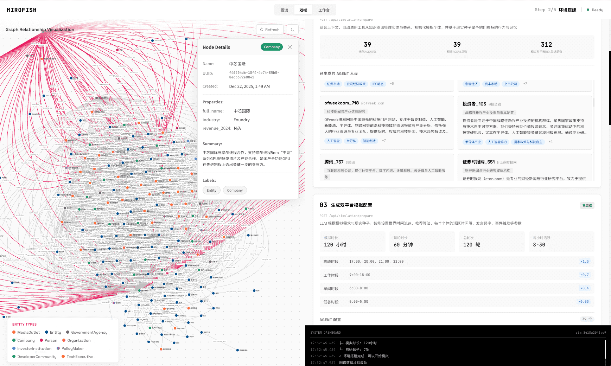

<div align="center">


**Multi-Agent AI Prediction Engine**

[](https://github.com/666ghj/MiroFish/stargazers)
[](https://github.com/666ghj/MiroFish/blob/main/LICENSE)
[](https://discord.com/channels/1469200078932545606/1469201282077163739)

</div>

## What is MiroFish?

MiroFish is a multi-agent AI prediction engine that extracts seed information from real-world data, builds parallel digital worlds populated by autonomous AI agents, observes emergent social dynamics, and predicts outcomes. Upload documents (PDF, Markdown, or plain text), describe what you want to predict in natural language, and MiroFish returns a detailed prediction report along with a fully interactive simulated world. Think of it as a rehearsal laboratory where you can test scenarios at zero risk before they play out in reality.

## Screenshots

<div align="center">
<table>
<tr>
<td></td>
<td></td>
</tr>
<tr>
<td></td>
<td></td>
</tr>
<tr>
<td></td>
<td></td>
</tr>
</table>
</div>

## How It Works

MiroFish runs a 5-step pipeline from raw documents to actionable predictions:

### Step 1: Graph Building

Upload PDF, Markdown, or TXT documents. The LLM extracts entities and relationships, then injects them into a knowledge graph powered by [Zep](https://www.getzep.com/). This graph serves as the shared memory and world model for all downstream agents.

### Step 2: Environment Setup

MiroFish reads entities from the knowledge graph and generates detailed AI agent profiles -- each with a unique personality, background, and behavioral logic. These profiles are assembled into a simulation configuration ready for launch.

### Step 3: Simulation

Agents are deployed into a dual-platform parallel simulation (Twitter-style and Reddit-style social networks) powered by the [OASIS](https://github.com/camel-ai/oasis) framework. Agents post, reply, react, and form opinions autonomously over multiple rounds.

### Step 4: Report Generation

A dedicated Report Agent with tool access (graph search, simulation data retrieval, statistical analysis) generates a comprehensive, structured prediction report based on everything that emerged during the simulation.

### Step 5: Deep Interaction

After the simulation completes, you can chat directly with any agent in the simulated world or continue conversing with the Report Agent to drill deeper into findings.

## Quick Start

### Prerequisites

| Tool | Version | Install |
|------|---------|---------|
| Python | 3.11 - 3.12 | [python.org](https://www.python.org/downloads/) |
| Node.js | 18+ | [nodejs.org](https://nodejs.org/) |
| uv | Latest | `pip install uv` |

### Step 1: Clone and Install

```bash
git clone https://github.com/666ghj/MiroFish.git
cd MiroFish
npm run setup:all
```

### Step 2: Get API Keys

- **OpenRouter** -- get your key at https://openrouter.ai/keys
- **Zep Cloud** -- sign up at https://app.getzep.com/ (free tier is sufficient for getting started)

### Step 3: Configure `.env`

```bash
cp .env.example .env
```

Edit `.env` with your keys:

```env
LLM_API_KEY=your_openrouter_key
LLM_BASE_URL=https://openrouter.ai/api/v1
LLM_MODEL_NAME=openai/gpt-4o-mini

ZEP_API_KEY=your_zep_key
```

### Step 4: Start the Application

```bash
npm run dev
```

This launches both services:

- **Frontend** -- http://localhost:3000
- **Backend API** -- http://localhost:5001

### Docker Alternative

```bash
cp .env.example .env
# Edit .env with your keys (see Step 3)
docker compose up
```

## Running Tests

```bash
cd backend && uv run pytest
```

## API Reference

All endpoints are served from the backend at `http://localhost:5001`.

| Endpoint | Method | Description |
|----------|--------|-------------|
| `/health` | GET | Health check |
| `/api/graph/ontology/generate` | POST | Upload documents and generate ontology |
| `/api/graph/build` | POST | Build knowledge graph from project |
| `/api/graph/data/<graph_id>` | GET | Retrieve graph nodes and edges |
| `/api/simulation/create` | POST | Create a simulation instance |
| `/api/simulation/prepare` | POST | Generate agent profiles and config |
| `/api/simulation/start` | POST | Start the simulation |
| `/api/simulation/interview` | POST | Interview an agent in the simulated world |
| `/api/report/generate` | POST | Generate a prediction report |
| `/api/report/chat` | POST | Chat with the Report Agent |
| `/api/report/<report_id>` | GET | Retrieve a completed report |

## Configuration

All configuration is done through environment variables in your `.env` file.

| Variable | Default | Description |
|----------|---------|-------------|
| `LLM_API_KEY` | (required) | OpenRouter API key |
| `LLM_BASE_URL` | `https://openrouter.ai/api/v1` | LLM API endpoint |
| `LLM_MODEL_NAME` | `openai/gpt-4o-mini` | Model identifier on OpenRouter |
| `ZEP_API_KEY` | (required) | Zep Cloud API key |
| `OPENROUTER_HTTP_REFERER` | (empty) | Optional: your app URL for OpenRouter dashboard |
| `OPENROUTER_X_TITLE` | `MiroFish` | Optional: app name shown in OpenRouter dashboard |
| `LLM_BOOST_API_KEY` | (optional) | Separate API key for simulation agents |
| `LLM_BOOST_BASE_URL` | (optional) | Endpoint for the boost LLM |
| `LLM_BOOST_MODEL_NAME` | (optional) | Model for simulation agents |

## Tech Stack

- **Backend** -- Flask (Python)
- **Frontend** -- Vue 3
- **Graph Visualization** -- D3.js
- **LLM Integration** -- OpenAI SDK (compatible with OpenRouter and any OpenAI-format API)
- **Knowledge Graph** -- Zep Cloud
- **Simulation Engine** -- CAMEL-AI OASIS

## Contributing

Contributions are welcome.

1. Fork the repository
2. Create a feature branch (`git checkout -b feature/your-feature`)
3. Commit your changes
4. Push to your fork and open a Pull Request

Please make sure tests pass (`cd backend && uv run pytest`) before submitting.

## Community

- [Discord](https://discord.com/channels/1469200078932545606/1469201282077163739)
- [X (Twitter)](https://x.com/mirofish_ai)

## Acknowledgments

MiroFish's simulation engine is built on [OASIS (Open Agent Social Interaction Simulations)](https://github.com/camel-ai/oasis) by the [CAMEL-AI](https://github.com/camel-ai) team. We thank them for their open-source contributions.

## License

This project is licensed under the [AGPL-3.0 License](https://github.com/666ghj/MiroFish/blob/main/LICENSE).
